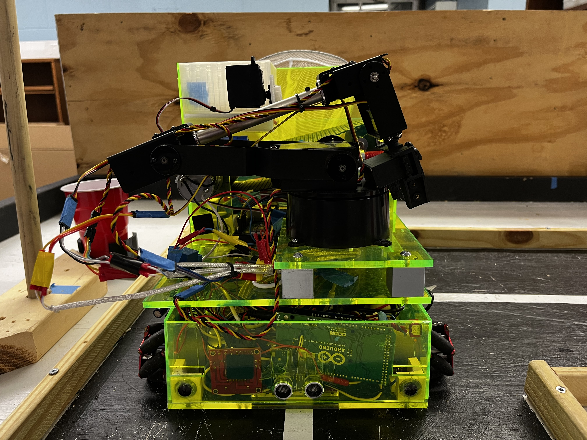
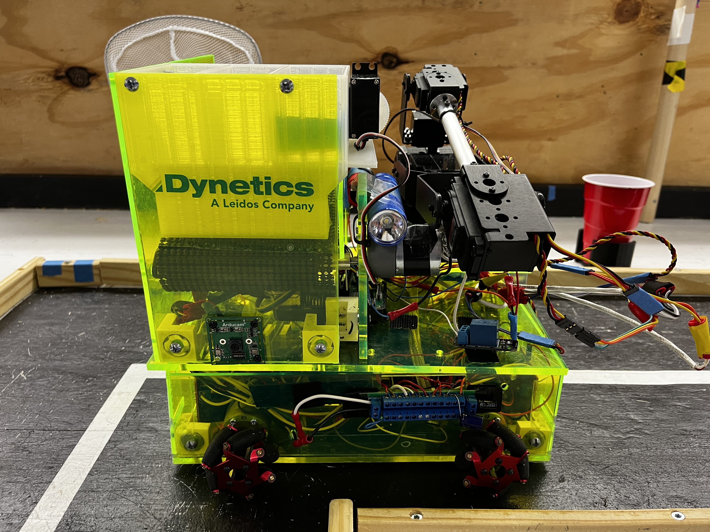
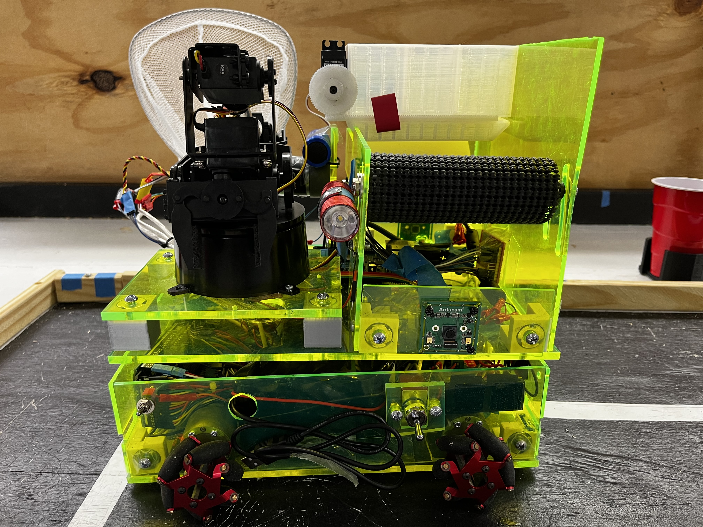
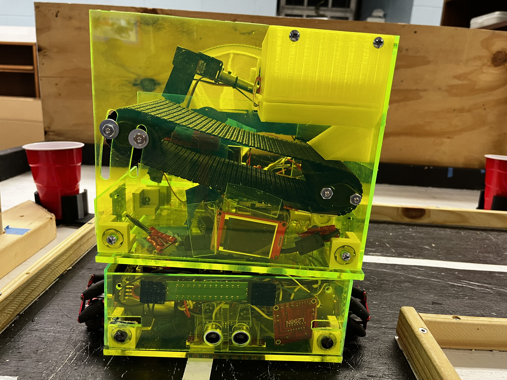
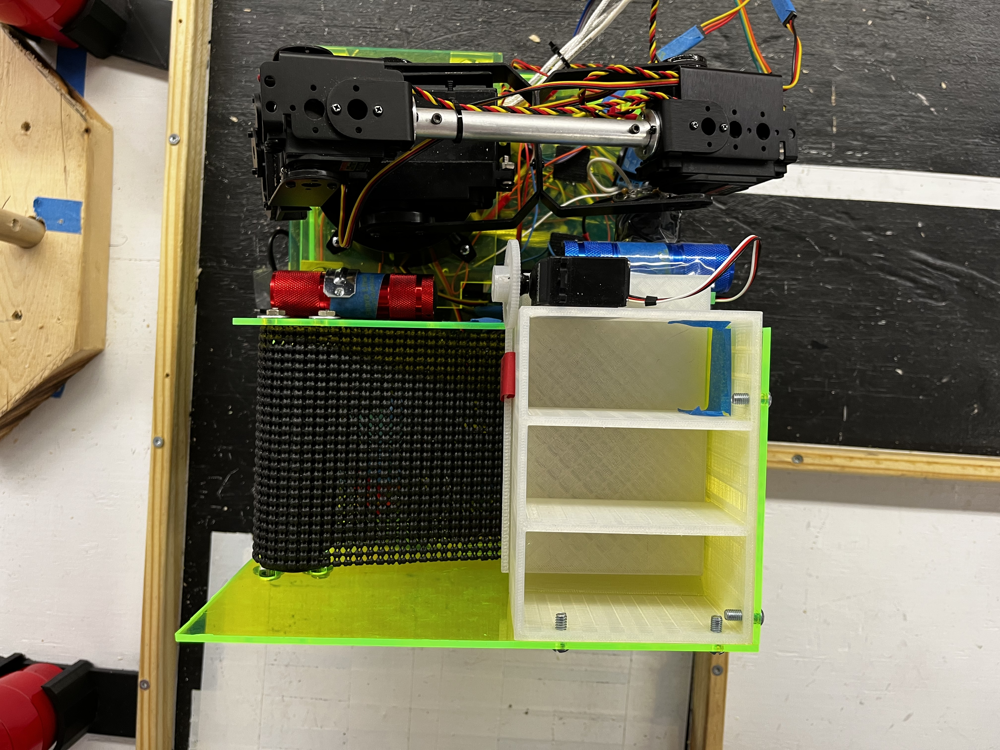

# SECON2022
## Tennessee Tech SoutheastCon 2022 Robot Project
## Executive Summary
The goal of this project was to design and build an autonomous robot to compete in the 2022 IEEE SoutheastCon Student Hardware Competition. 
The theme of the competition was Mardi Gras, and the competition format reflected this. The robot had to navigate a track while completing 
tasks and avoiding obstacles, all within a three-minute time limit. The team consists of two Electrical Engineers and two Computer Engineers. 
The engineers on this team leveraged their academic background in microcontrollers, power, and control systems, and acquired other necessary 
knowledge in areas such as computer vision and Mechanical Engineering. 

## Version Contained In This Repo
The version of the project contained in this repo has been updated since the competition. All software files necessary to play the full game 
are contained under the Software heading.

## Outcomes
Due to last minute optimizations before the competition, the team was unable to showcase the full design and capabilities of the robot. 
This project earned a ranking of 7th place out of the 38 teams that attended the competition. The initial proposed budget for this project 
was $2000, and the final BOM indicated a final budget of $2,023.49.

## Video

<figure class="video_container">
  <video controls="true" allowfullscreen="true">
    <source src="./Documentation/Photos/Video1.mp4" type="video/mp4">
  </video>
</figure>

## Pictures
### Front of Robot

### Right Side of Robot

### Left Side of Robot

### Back of Robot

### Top View of Robot

### Interior of Lower Chassis

## About Us
As mentioned in the summary, this team consisted of two Electrical Engineers and two Computer Engineers. The two Electrical Engineers are 
Chase Garner and Sawyer Hall, and the two Computer Engineers are Daniel Summers and Lexi Sheeler. The faculty member that oversaw the 
development of this project is Jesse Roberts. There was no customer for this project, however the project was designed to meet the 
specifications provided by the competition organizers.

## Repo Index
### Project Documentation
<ul>
  <li>Design Documents
    <ul>
      <li>3D Models</li>
      <li>Power</li>
    </ul>
  </li>
  <li>Bill of Materials</li>
  <li>Datasheet</li>
  <li>Project Poster</li>
  <li>Photos</li>
</ul>

### Reports
<ul>
  <li>Project Proposal</li>
  <li>Design Phase 1</li>
  <li>Design Phase 2</li>
  <li>Final Report</li>
</ul>

### Software
<ul>
  <li>Raspberry Pi</li>
  <li>SECON_Arduino</li>
</ul>
